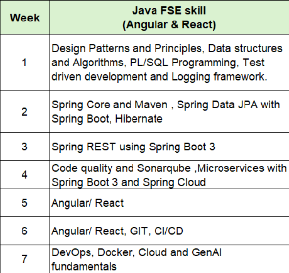

# **My Cognizant Weekly Assignment**

This repository contains my weekly assignments, exercises, and learning activities completed as part of the Cognizant training program. The repository is organized in a structured manner to track progress throughout the training period.

> ## Note: This README.md will be continuously updated as the weeks progress and is not complete yet. 

> Completed Weeks: **2**

## Project Overview

The purpose of this repository is to:

* Maintain a record of weekly assignments.
* Showcase learning progress and practical implementations.
* Organize solutions in a clean and structured format.
* Facilitate easy navigation and review of completed work.

---

## Solution Structure

The project follows a **weekly submission model**, where each week's work is stored in a dedicated folder.

### Week Structure

### Directory Structure Style

* Each week has its own directory.
* Inside the weeks directories the exercise solutions will saved with same naming scheme as provided by the [Digital-Nurture-JavaFSE](https://github.com/seshadrimr/Digital-Nurture-JavaFSE) repository.
* Assignments are grouped under the corresponding week.
* Solutions can be in the form of images, code files or docs.

---

## Technologies Used

Depending on the weekly assignments, the repository includes:

* Java 
* Oracle Database for PL/SQL
* Spring, JPA, Hibernate, Maven
* MySQL & MySQL WorkBench
* Other technologies introduced during training

## Objectives

* Apply concepts learned during Cognizant training.
* Develop problem-solving and programming skills.
* Practice industry-standard coding practices.

## Weekly Progress

| Week   | Status      |
| ------ | ----------- |
| Week 1 | Completed Mandatory Exercises  |
| Week 2 | Completed|
| Week 3 | Pending     |
| Week 4 | Pending     |
| Week 5 | Pending     |
| Week 6 | Pending     |
| Week 7 | Pending     |

---

## Notes

* Solutions are provided for educational and learning purposes.
* Code may be updated and improved as new concepts are learned.
* Folder structure may evolve based on assignment requirements.

## Author

**_Name_: Shreyansh Dipak Kumar Pande**

**_SuperSet ID_ : 8016320**

Cognizant Digital Nurture 5.0 Participant

---

### Thank You

This repository serves as a learning journal and progress tracker throughout the Cognizant training journey.
